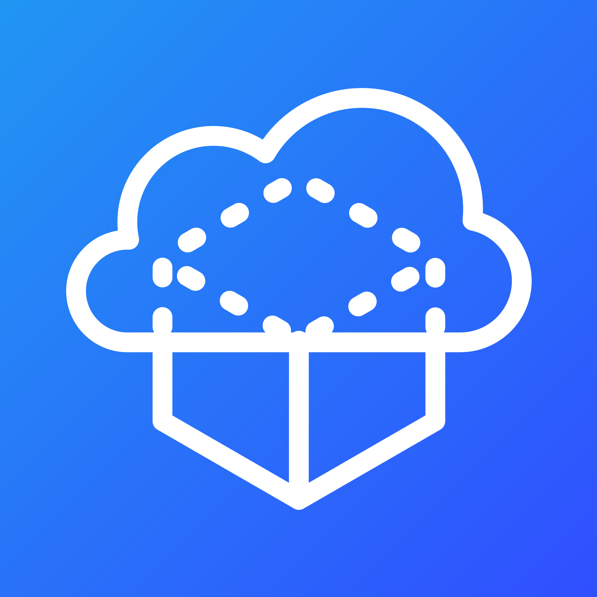

# Branding

[[toc]]

## Logo

### PNG

Attribute | Value
--- | ---
Height | `2048 px`
Width | `2048 px`
Pixel Density | `300 PPI`
Color Space | `sRGB`
Encoding | `32-bit (8 bits/channel with alpha)`
Size | `2.31 MiB`

### WebP

Attribute | Value
--- | ---
Height | `2048 px`
Width | `2048 px`
Pixel Density | `72 PPI`
Color Space | `sRGB`
Encoding | `32-bit (8 bits/channel with alpha)`
Size | `72.1 KiB`

### Source

*Note: while this is a valid SVG, it's strongly recommended against directly using it as an image.
You can download the source <SourceLink path="packages/docs/src/docs/branding/logo.svg">here</SourceLink>.*

Attribute | Value
--- | ---
Height | `2048 px`
Width | `2048 px`
Pixels/Unit | `10.666667`
Size | `20.0 KiB`
Editor | [Inkscape](https://inkscape.org)

## Colors

### Primary
 (`#2196f3`)

### Secondary
 (`#304fff`)