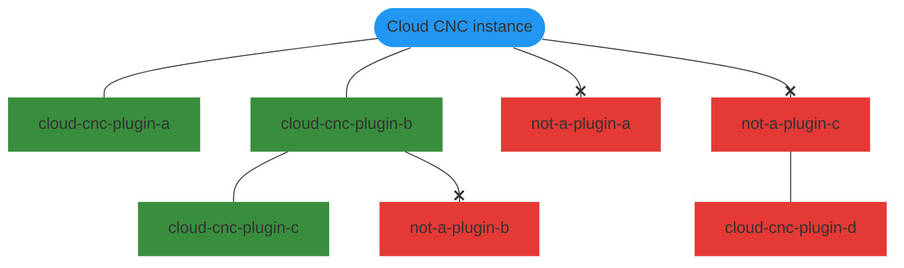

# Plugins

## Preface
The key words "MUST", "MUST NOT", "REQUIRED", "SHALL", "SHALL NOT", "SHOULD", "SHOULD NOT",
"RECOMMENDED", "MAY", and "OPTIONAL" in this document are to be interpreted as described in
[RFC 2119](https://www.ietf.org/rfc/rfc2119.txt).

## Publishing
Cloud CNC plugins are published to [NPM](https://npmjs.com) (just like most JavaScript and
TypeScript libraries). This means that standard NPM tooling SHOULD work with Cloud CNC plugins with
minimal effort.

## Metadata
In order to aid in discovering Cloud CNC plugins among the vast number of unrelated libraries on NPM,
plugins MUST do several things in order to be discovered and loaded:
* The package [`name`](https://docs.npmjs.com/cli/v8/configuring-npm/package-json#name) property
MUST start with `@cloud-cnc/plugin-` (For 1st party plugins) or `cloud-cnc-plugin-` (For scoped and
unscoped 3rd party plugins). Note that `@cloud-cnc/plugin-sdk` is the sole exception and is not a
plugin! The following examples are all valid plugin names: `@cloud-cnc/plugin-example`,
`cloud-cnc-plugin-example`, and `@example/cloud-cnc-plugin-example`.
* The package [`keywords`](https://docs.npmjs.com/cli/v8/configuring-npm/package-json#keywords)
property MUST contain `cloud-cnc-plugin` (additional values MAY be present).
* The package [`exports`](https://nodejs.org/api/packages.html#subpath-exports) property MAY
contain the following entries (additional entries SHOULD NOT be present; additional entries MUST
use different keys to prevent colliding with the below keys):
  * The `./relay` subpath-export MUST point to the entrance file for the relay portion of the plugin
  * The `./server` subpath-export MUST point to the entrance file for the API-server portion of the
    plugin
  * The `./ui` subpath-export MUST point to the entrance file for the UI portion of the plugin
* The package `cloud-cnc` property must contain the following entries (additional entries SHOULD
NOT be present):
  * The `version` property MUST match a semantic version range as defined by
  [`node-semver`](https://github.com/npm/node-semver#ranges). This defines what versions of Cloud
  CNC the plugin is compatible with (Very similar to
  [peer dependencies](https://docs.npmjs.com/cli/v8/configuring-npm/package-json#peerdependencies),
  however Cloud CNC itself is not published to NPM, thus using peer dependencies for this would not
  work).

### Example
```json
{
  "name": "cloud-cnc-plugin-example",
  "keywords": [
    "cloud-cnc-plugin"
  ],
  "exports": {
    "./relay": "./dist/relay.js",
    "./server": "./dist/server.js",
    "./ui": "./dist/ui.js",
  },
  "cloud-cnc": {
    "version": "<= 1.0.0"
  }
}
```

::: warning
Do not copy-paste the (entire) example because it omits some extremely useful metadata (eg: version,
description, license, and repository)! Use the
[`npm init`](https://docs.npmjs.com/cli/v8/commands/npm-init) command and then add any missing
metadata afterwards, instead.
:::

## Recursion
Plugins are recursively loaded. A plugin's own dependencies will be checked to see if any match the
above metadata specification, and if they do, they will be loaded just like top-level plugins. Note
that to reduce the likelihood of loading unintended plugins, if a dependency does not match the
above metadata specification, none of its own dependencies will be checked.

### Example

*Note how `cloud-cnc-plugin-d`, while valid, isn't loaded because its parent isn't a plugin.*

## 1st vs 3rd Party
1st party plugins refer to plugins hosted in the
[Cloud CNC GitHub organization](https://github.com/cloud-cnc) and published under the [`cloud-cnc`
NPM organization](https://npmjs.com/org/cloud-cnc). 3rd party plugins refer to all plugins
that do not meet every requirement for 1st party plugins.