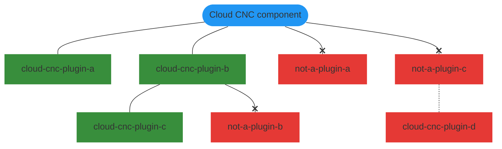

# Plugin Specification

[[toc]]

## Preface

The key words "MUST", "MUST NOT", "REQUIRED", "SHALL", "SHALL NOT", "SHOULD", "SHOULD NOT",
"RECOMMENDED", "MAY", and "OPTIONAL" in this document are to be interpreted as described in
[RFC 2119](https://www.ietf.org/rfc/rfc2119.txt).

All examples provided in this specification are **non-normative.**

## Publishing

Cloud CNC plugins are published to [NPM](https://npmjs.com) (just like most JavaScript and
TypeScript libraries). This means that standard NPM tooling SHOULD work with Cloud CNC plugins with
minimal effort.

## Metadata

In order to aid in discovering Cloud CNC plugins among the vast number of unrelated libraries on
NPM, plugins MUST define certain properties in their
[`package.json`'s](https://docs.npmjs.com/cli/v8/configuring-npm/package-json) in order to be
discovered and loaded.

### `name`

The package [`name`](https://docs.npmjs.com/cli/v8/configuring-npm/package-json#name) property
MUST start with `@cloud-cnc/plugin-` (For 1st party plugins) or `cloud-cnc-plugin-` (For scoped and
unscoped 3rd party plugins). The following examples are all valid plugin names:
`@cloud-cnc/plugin-example`, `cloud-cnc-plugin-example`, and `@example/cloud-cnc-plugin-example`.

:::warning
`@cloud-cnc/plugin-sdk` is the sole exception to this rule and is not a plugin!
:::

### `keywords`

The package [`keywords`](https://docs.npmjs.com/cli/v8/configuring-npm/package-json#keywords)
property MUST contain `cloud-cnc-plugin`. Additional values MAY be present.

### `exports`

The package [`exports`](https://nodejs.org/api/packages.html#subpath-exports) property MAY contain
the following entries:

* The `./relay` subpath-export MUST point to the relay plugin entrypoint
* The `./server` subpath-export MUST point to the server plugin entrypoint
* The `./ui` subpath-export MUST point to the UI plugin entrypoint

See the [Plugin Types](#plugin-types) subsection for more information on each plugin type.
Additional entries SHOULD NOT be present. If additional entries are present, they MUST use different
keys to prevent colliding with the above keys.

:::danger
There are **NO GUARANTEES** that future versions of Cloud CNC won't use any key not listed above!
:::

### `cloud-cnc`

The package `cloud-cnc` property must contain the following entries:

* The `version` property MUST match a semantic version range as defined by
  [`node-semver`](https://github.com/npm/node-semver#ranges). This defines what versions of Cloud
  CNC the plugin is compatible with (Very similar to
  [`peerDependencies`](https://docs.npmjs.com/cli/v8/configuring-npm/package-json#peerdependencies),
  however Cloud CNC itself is not published to NPM, thus using peer dependencies for this would not
  work).

Additional entries SHOULD NOT be present. If additional entries are present, they MUST use different
keys to prevent colliding with the above keys.

:::danger
There are **NO GUARANTEES** that future versions of Cloud CNC won't use any key not listed above!
:::

### Example

```json
{
  "name": "cloud-cnc-plugin-example",
  "keywords": [
    "cloud-cnc-plugin"
  ],
  "exports": {
    "./relay": "./dist/relay.js",
    "./server": "./dist/server.js",
    "./ui": "./dist/ui.js",
  },
  "cloud-cnc": {
    "version": "<= 1.0.0"
  }
}
```

::: warning
Do not copy-paste the (entire) example because it omits some extremely useful metadata (eg: version,
description, license, and repository)! Use the
[`npm init`](https://docs.npmjs.com/cli/v8/commands/npm-init) command and then add any missing
metadata afterwards, instead.
:::

## Recursion

Plugins are recursively loaded. A plugin's own
[`dependencies`](https://docs.npmjs.com/cli/v8/configuring-npm/package-json#dependencies)
(But not [`peerDependencies`](https://docs.npmjs.com/cli/v8/configuring-npm/package-json#peerdependencies)
nor [`devDependencies`](https://docs.npmjs.com/cli/v8/configuring-npm/package-json#devdependencies))
will be scanned to see if any match the above metadata specification, and if they do, they will be
loaded just like top-level plugins.

:::warning
To reduce the likelihood of loading unintended plugins, if a dependency does not match the above
metadata specification, none of its own dependencies will even be scanned/loaded.
:::

### Example



:::tip
Note how, while the `cloud-cnc-plugin-d` plugin is valid, it isn't loaded because its parent isn't
valid.
:::

## 1st vs 3rd Party

1st party plugins refer to plugins hosted in the
[Cloud CNC GitHub organization](https://github.com/cloud-cnc) and published under the [`cloud-cnc`
NPM organization](https://npmjs.com/org/cloud-cnc). 3rd party plugins refer to all plugins
that do not meet every requirement for 1st party plugins.

## Plugin Types

Cloud CNC supports several different plugin types that modify and extend the various components of
Cloud CNC. The following are all plugin types defined at the time of publishing this specification:

Name | Description
--- | ---
Relay plugins | Plugins that are installed with and interact with Cloud CNC relays
Server plugins | Plugins that are installed with and interact with Cloud CNC API servers
UI plugins | Plugins that are installed with and interact with Cloud CNC UI's

*Note: a single package may contain one or more Cloud CNC plugin types, but never multiple of the
same type.*

### Relay Plugins

TODO

### Server Plugins

TODO

### UI Plugins

#### Entrypoint

A UI plugin should default-export a call to the [`defineUiPlugin`](/docs/plugins/api/modules/plugin_sdk_src/#defineuiplugin)
helper (From the plugin SDK).

#### Source-merging

To facilitate extending the UI, UI plugins have the ability to merge their own source code with the
original UI source code prior to building. This is performed by recursively copying the original UI
source code and then all target files/directories identified in the [`merge` property](/docs/plugins/api/interfaces/plugin_sdk_src_types/#merge)
of the `defineUiPlugin` call for each UI plugin to a temporary directory (`.merged`) and then
building the UI from the temporary directory.

#### Portals

To facilitate modifying the UI, UI plugins have the ability to inject
[Vue components](https://vuejs.org/guide/essentials/component-basics.html) into other Vue components
via a [Vue portal](https://portal-vue.linusb.org)-inspired mechanism.

A `PluginTarget` (`plugin-target`) component is the component that plugins may target using a `PluginPortal`
(`plugin-portal`) component. That is to say, the [default slot](https://vuejs.org/guide/components/slots.html#slot-content-and-outlet)
of the `PluginPortal` will be transported to the `PluginTarget` so long as the `name` attribute
matches (Valid name attributes can be found by inspecting a target component for `plugin-target`
component instances).

All components defined in the [`portals` property](/docs/plugins/api/interfaces/plugin_sdk_src_types/#portals)
of the `defineUiPlugin` call are injected into a hidden div (With the `plugin-portals` class) at the
bottom of their target components at compilation time.

:::warning
To prevent broken plugins from interfering with the page layout, all content not placed inside of a
`PluginPortal` (`plugin-portal`) instance are hidden!
:::

#### Example

Because the `pages/auth.vue` component contains the below code for adding additional authentication
methods,
```vue
<!-- Additional methods -->
<plugin-target name="additional-methods" />
```

if we define a component named `portals/additional-methods.vue` in our plugin with the below code,
```vue
<template>
  <plugin-portal name="additional-methods">
    <v-btn block color="black" prepend-icon="Github">
      GitHub
    </v-btn>
  </plugin-portal>

  <plugin-portal name="additional-methods">
    <v-btn block color="orange" prepend-icon="Gitlab">
      GitLab
    </v-btn>
  </plugin-portal>
</template>
```
and add the below to our entrypoint,
```typescript
//Imports
import {defineUiPlugin} from '@cloud-cnc/plugin-sdk';

//Export
export default defineUiPlugin({
  name: 'git-auth-providers',
  merge: {
    'portals': 'src/portals'
  },
  portals: {
    'src/portals/additional-methods.vue': 'src/pages/auth.vue'
  }
});
```
we can inject additional authentication methods without overriding the original ones. See
[`defineUiPlugin`](/docs/plugins/api/modules/plugin_sdk_src/#defineuiplugin) for more information.